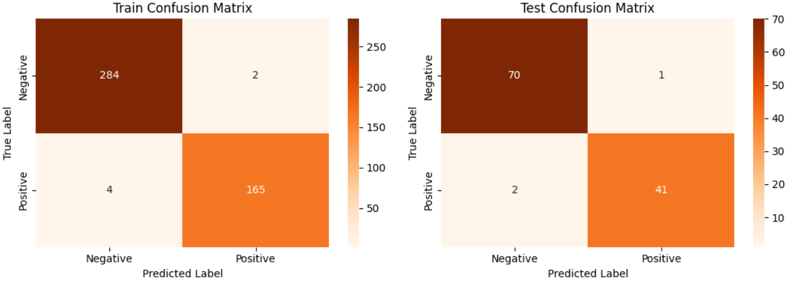
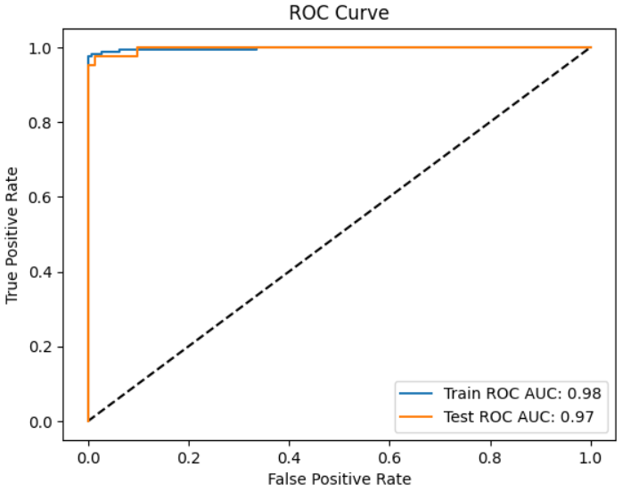
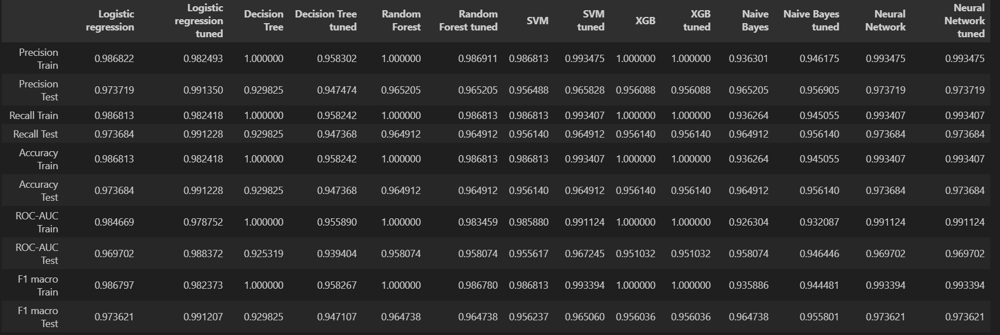

# breast-cancer-diagnosis-ml
# Breast Cancer Prediction

This project explores a machine learning workflow for classifying breast tumors as benign or malignant. The analysis uses the Breast Cancer Wisconsin Diagnostic dataset, stored in [data/breast_cancer_data.csv](data/breast_cancer_data.csv), and is implemented in [analysis/prediction.ipynb](analysis/prediction.ipynb). The goal is to build a predictive model that can support early screening workflows, while keeping the scope clearly experimental and non-clinical.

## Project overview

The notebook prepares a tabular dataset with tumor measurements and trains several classification models to predict the diagnosis label. The workflow includes data loading, feature scaling, train-test splitting, model training, and evaluation using classification metrics.

## Dataset

The repository uses the Breast Cancer Wisconsin Diagnostic dataset. The CSV contains one diagnosis column and 30 numeric feature columns describing tumor characteristics such as radius, texture, perimeter, area, smoothness, compactness, concavity, symmetry, and fractal dimension. Each row is labeled as malignant or benign.

## Workflow and models evaluated

The notebook evaluates a small set of classical classifiers:

- Logistic Regression
- Decision Tree Classifier
- Random Forest Classifier
- Support Vector Machine (SVM)

The workflow uses standard preprocessing steps such as scaling the features before training and comparing model performance on a held-out test set.





## Final results

The best-performing configuration in the notebook was the tuned Logistic Regression model on the test set.

| Model | Accuracy | Precision | Recall | ROC-AUC |
| --- | ---: | ---: | ---: | ---: |
| Logistic Regression (tuned) | 0.9912 | 0.9914 | 0.9912 | 0.9884 |



## Project structure

- [analysis/prediction.ipynb](analysis/prediction.ipynb) — notebook with the full analysis and model evaluation
- [data/breast_cancer_data.csv](data/breast_cancer_data.csv) — dataset used for training and evaluation
- [assets](assets) — figures generated from the analysis, including confusion matrices, ROC curves, and model summaries

## Installation and usage

This project is written in Python and uses common data-science libraries from the notebook workflow.

```bash
python -m venv .venv
source .venv/bin/activate  # macOS/Linux
# .venv\Scripts\activate  # Windows PowerShell
pip install jupyter pandas scikit-learn matplotlib
jupyter notebook analysis/prediction.ipynb
```

## Technologies used

- Python
- Jupyter Notebook
- pandas
- scikit-learn
- matplotlib

## Limitations and medical disclaimer

This repository is an educational machine learning project and is not clinically validated. The model is intended for experimentation and learning, not for direct medical diagnosis or treatment decisions. Any real-world medical use should involve qualified clinicians, proper validation, and appropriate regulatory review.

